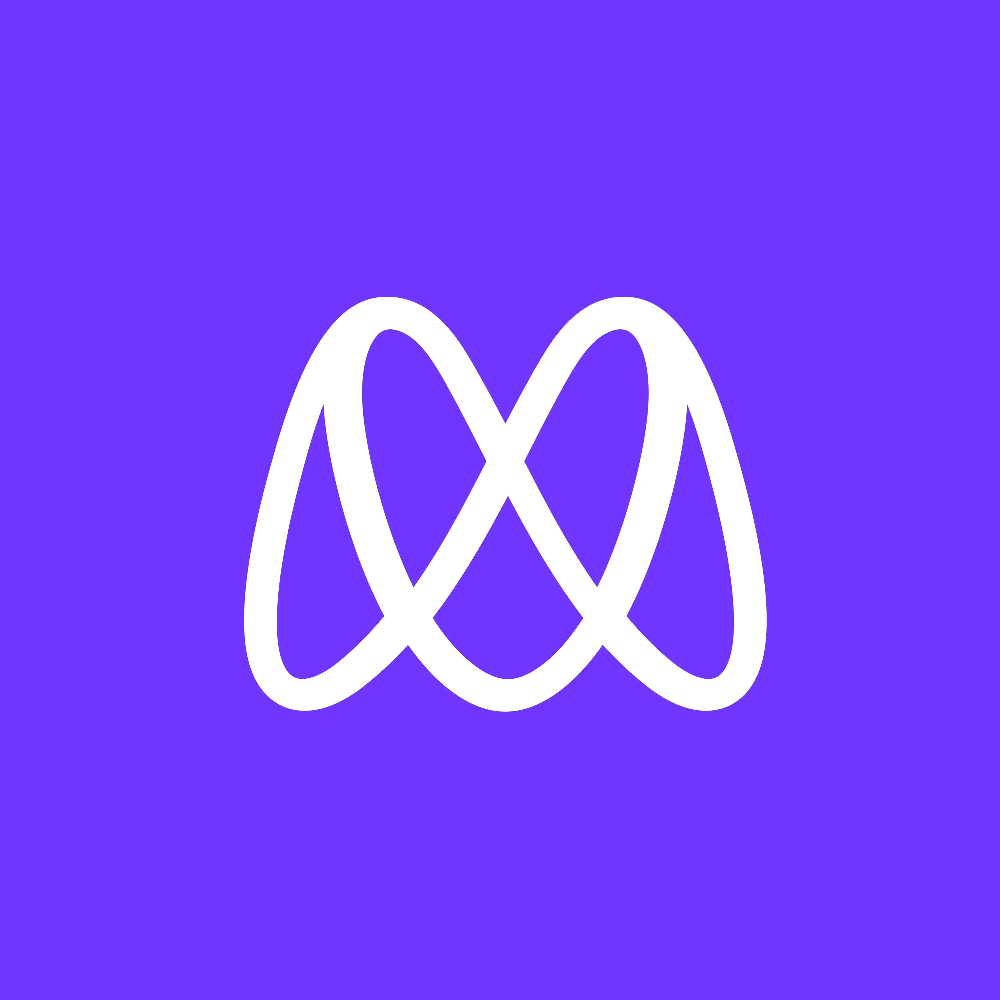

  
   

  <h3><b>
My First Microverse Capstone Project</b></h3>

  # 🛠 Built With

- HTML 5
- CSS 3
- Javascript

 # Key Features

 > This is first Portfolio website.
 > It shows all my work history.

# 🔭 Future Features

 > I will be adding form validation next.

## Learning Objectives

- Flexbox to place elements in the page.
- Use images and backgrounds to enhance the look of the website.
- How to use javascript to add functionallity to my website.
- How to use Javascript objects.
- Practice of all the knowledge i learned in this module.

# 📖 The webster (First capstone project)

> This is a website of a web designing company.
> In this capstone project I have built a website according to the layout that was provided.

<!-- Features -->

### Key Features 

> Describe between 1-3 key features of the application.

- **[It's a website according to the design provided]**
- **[I personalized the content and create a website for a web designing business.]**
- **[This website is my first capstone project.]**

<!-- LIVE DEMO -->

## 🚀 Live Demo 

> Add a link to your deployed project.

- [Live Demo Link](https://gsmalik-the-webster.github.io/)

### Prerequisites

In order to run this project you need:

I completed all the previous blocks.

### Setup

Clone this repository to your desired folder:

**Just clone the project by runing the `git clone git@github.com:gsmalik030/the-webster-.git` command in your command line, and you are done.**

<!-- AUTHORS -->

👤 **Ghulam Subbhani(Malik)**

- GitHub: [@githubhandle](https://github.com/gsmalik030)
- Twitter: [@twitterhandle](https://twitter.com/gsmalik030)
- LinkedIn: [LinkedIn](https://www.linkedin.com/in/ghulam-subbhani-4b1281252/)

<!-- CONTRIBUTING -->

## 🤝 Contributing 

Contributions, issues, and feature requests are welcome!

Feel free to check the [issues page](../../issues/).

(<a href="#readme-top">back to top</a>)

<!-- SUPPORT -->

## ⭐️ Show your support 

If you like this project...

Give a ⭐️ if you like my effort!

(<a href="#readme-top">back to top</a>)

<!-- ACKNOWLEDGEMENTS -->

## 🙏 Acknowledgments 

> [Cindy Shin](https://www.behance.net/gallery/29845175/CC-Global-Summit-2015) The designer of this beautiful layout.

(<a href="#readme-top">back to top</a>)

<!-- LICENSE -->

## 📝 License 

This project is [MIT](./LICENSE) licensed.
(https://github.com/gsmalik030Portfolio/gsmalik030Portfolio.github.io/blob/main/LICENSE) 

(<a href="#readme-top">back to top</a>)

